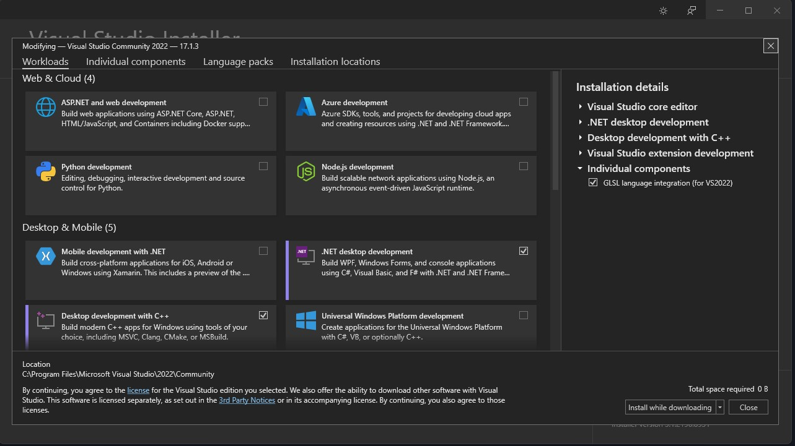

# Getting Started
 
## Requirements
One of our goals is to make Hazel as easy as possible to build - if you're having any difficulties or weird errors, please let us know. We currently only support building on Windows 10 and Windows 11 with Visual Studio 2022, Visual Studio 2019 is no longer supported. The minimum supported version of Visual Studio 2022 is 17.2.0, Hazel may not compile on versions before that. You also need the following installed:

Here you'll find a list of all the third-party tools and SDKs that you'll need to install in order to build Hazel:
 - [Git](https://git-scm.com/downloads)
 - [Git-LFS](https://git-lfs.github.com/)
 - [Python 3](https://www.python.org/downloads/)
 - [.NET Framework 4.7.2](#net-framework)
 - [Vulkan](#vulkan)

Make sure that you add everything except for the .NET Framework SDK to your PATH environment variable. Most likely the installers will give you the option to so automatically.

## Building and Running
Assuming that's all installed and ready to go, you can proceed with the following:

1. Clone the repository: `git clone --recursive https://github.com/StudioCherno/Hazel.git`
2. Run `Scripts/Setup.bat` - this will download required libraries and make sure everything is setup correctly
3. Open `Hazel.sln` and build either `Debug` or `Release` `x64` - Hazelnut should be the startup project so really you can just hit `F5` to build and debug the startup project. By default, this will load the _Sandbox_ project found in `Hazelnut/SandboxProject/Sandbox.hproj`
4. Open `Hazelnut/SandboxProject/Sandbox.sln` and build in either `Debug` or `Release`. This will build the C# module of the _Sandbox_ project which is necessary to properly play the various scenes in the project.

## .NET Framework
Hazel makes use of C# as a scripting language, and because of that we also provide a "Hazel-ScriptCore" project, which contains Hazels C# API. This however means that in order to build Hazel you need to have the .NET Framework SDK installed. Hazel makes use of .NET Framework 4.7.2, and all projects that are made in Hazel also use that specific version.

If you're using Visual Studio to build Hazel you'll have to open the Visual Studio Installer program, and make sure you've selected the ".NET desktop development" workload from the "Workloads" tab, you can find an example of this in the image below.

You may be required to restart your computer after installing the workload.

## Vulkan
Hazel requires Vulkan SDK 1.3.204.1 to be installed, and the `VULKAN_SDK` environment variable set to your installation path. If you do not have the correct version installed, the Setup script should offer to download and install the correct version for you.

The Vulkan SDK installer now offers to download and install shader debug libraries - you **must** install these libraries if you would like to build Hazel in the Debug configuration. To do so, simply check the `(Optional) Debuggable Shader API Libraries - 64 bit` option in the `Select Components` part of the installer, as seen in the image below.

You can also [download and install the Vulkan SDK manually](https://sdk.lunarg.com/sdk/download/1.3.204.1/windows/VulkanSDK-1.3.204.1-Installer.exe) if you wish, or if the Setup scripts have failed.

## Pulling the latest code
The `master` branch is required to always be stable, so there should never be any build errors or major faults. Once you've pulled the latest code, remember to run `Scripts/Setup.bat` **again** to make sure that any new files or configuration changes will be applied to your local environment.

## Next Steps
Probably an overview of Hazelnut and the basic architecture.
