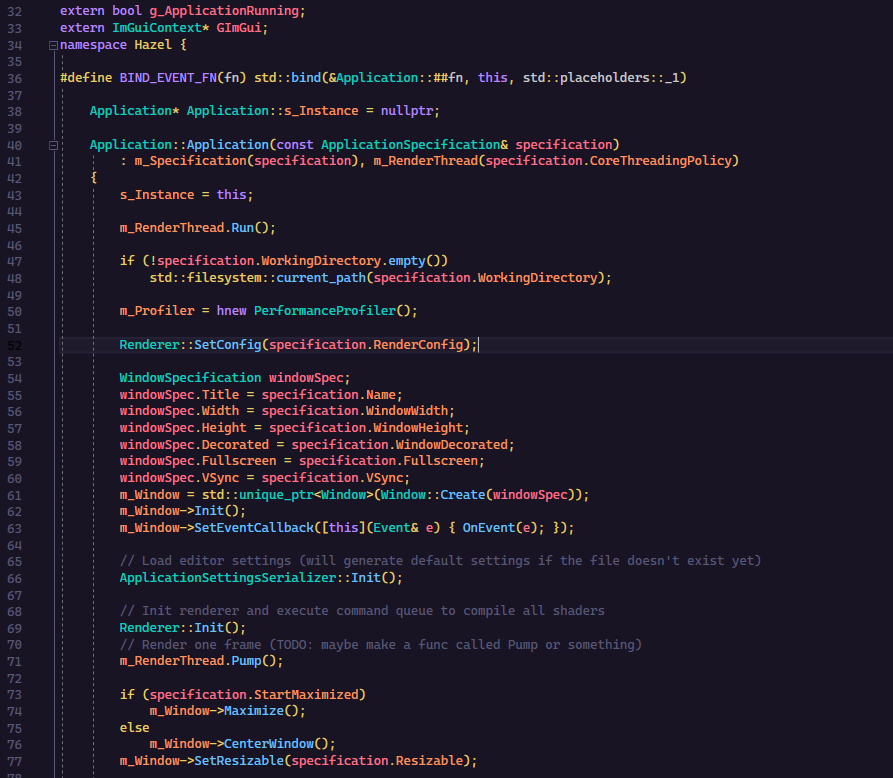

 
    
    <h1> Hazel For Engineers </h1>

Here you will find documentation on Hazel's internal systems, how they work and how to extend them as you might need them.

One of the goals of Hazel and it's developers is to make a versatile tool that is accessible and extendable to how a user might see it fit, in order to accomplish this we adhere to certain coding standards, to ensure that the code is readable and understandable to the user. 

    

        

            

                <a id="pageLink" href="../HazelForEngineers/DeveloperGuide.md">
                    

                        
                    

                    

                        

                            
 
                                
 Developer Guide 
 
                            
 
                            
 This document is an outline of the etiquette that Hazel's engineers follow. 
 
                        
 
                    
 
                </a>
            

        

        

            

                <a id="pageLink" href="../HazelForEngineers/AssetSystem/AssetSystemPage.md">
                    

                        
                    

                    

                        

                            
 
                                
 Asset System 
 
                            

                            
 Adding custom assets can be a complex task, this guide will show a simple overview of integrating any custom asset with the existing Asset System. 
 
                        
 
                    
 
                </a>
            

        

        

            

                <a id="pageLink" href="../HazelForEngineers/Scripting/ScriptingPage.md">
                    

                        
                    

                    

                        

                            
 
                                
 Scripting System 

                                
 Learn how the scripting system works and how to extend the API to suit your needs. 
 
                            
 
                        
 
                    
 
                </a>
            

        

    

