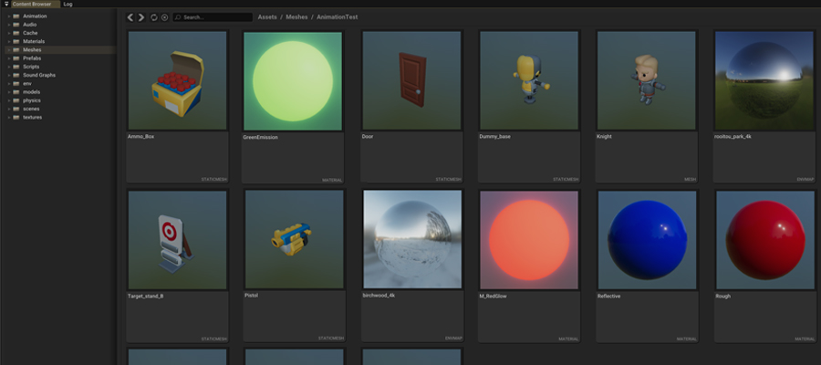

 
    
    <h1> Hazel 2024.1 Release Notes 📝 </h1>

## New Features 📈

### Animation System
Hazel's animation system continues to be improved in 2024.1, with many new features and improvements. There is a roadmap available on the [Hazel Milanote board](https://app.milanote.com/1QPDXj1zWMARc5/animation-system?p=mWjNxrKO9QK).

Here is an overview of the new features since 2023.1:

- State machine editor and runtime
- Blending animations and state transitions
- Animation events
- Animation asset compression
- Blend spaces (2D blends)
- Additive blends
- "One shot" and "conditional" blends
- IK: Aim (basic)

### Scripting Engine
Hazel 2024.1 includes a new C# scripting engine called [Coral](https://github.com/StudioCherno/Coral), which has been open-sourced and can be used in projects other than Hazel.

Coral is a C++/C# wrapper around the .NET CoreCLR library, with the purpose of providing a native interface similar to Mono, but in a more modern style, using .NET Core instead of .NET Framework.

Hazel now requries .NET 8 ([see .NET SDK on the Getting Started page](/Welcome/GettingStarted#net-sdk)).

### Async Asset System
Hazel 2024.1 introduces an asynchronous asset system which runs on an asset thread, improving performance and usability. Benefits include:

- Background loading of assets using `AssetManager::GetAssetAsync` which improves performance, particularly in Hazelnut
- Automatic hot-reloading of assets which have changed on disk, thanks to the asset monitoring system running on the background asset thread

### Content Browser Thumbnails
The Content Browser panel now has thumbnails for meshes, textures, materials, and environment maps which greatly improves usability, especially when prototyping. This feature will be expanded in the future to include other asset types, such as prefabs and audio assets.

## Changes and Bug Fixes 🐞

### Packaging and Runtime
- Hazel's packaging system has greatly been simplified and now requires less manual input with the introduction of project data files. See [The Runtime and Shipping Your Game](/WorkingWithinHazel/RuntimeShipping) page for more details

### Assets
- New much more powerful UI for creating meshes, importing animations, etc. from MeshSource
- Reload MeshSource when parent asset is reloaded
- Asset packaging and serialization fixes

### Build
- Added Docker support for Linux builds

### Core
- Fixed `Hazel::Buffer::Allocate` not setting size to 0 correctly
- Editor log messages now also go to stdout

### Editor, Projects and Workflow
- Creating a new project will now also create a new scene (called Main) and set this as the startup scene
- New projects now include all core Hazel C# libraries in solution
- Add empty space at the bottom of hierarchy panel so you can easier create new entity
- Make auto-save less annoying - auto-save will now only save if the scene has changed since it was last serialized. This avoids spurious "there is a newer auto-save" nags
- Material editor fixes

### Physics
- `Teleport()` method removed from RigidBody component
- To "teleport" an entity, you simply set its translation and or rotation.  This is the same irrespective of whether the entity has a RigidBody (of any type) or a character controller
- To move an entity via physics (i.e. not teleporting), then use the appropriate method on the physics component (e.g. `RigidBody.AddForce()`, `RigidBody.MoveKinematic()`, `CharacterController.Move()` or whatever)
- Kinematic physics bodies now have their physics world positions synchronized with Hazel world position during the physics simulation.
- CharacterController component has new properties to control whether movement/rotation can be player controlled while the character is in air.
- CharacterController will automatically apply appropriate horizontal "momentum" when character is in air (assuming player control while in air is turned off)
- Added `Rotate()` method to CharacterController component (mirroing kinematic body Rotate()).
- `SetRotation(quat)` on TransformComponent is now much less likely to produce 180 degree flips in the Euler angle representation of the rotation.
- Add RotationQuat property to TransformComponent and a shortcut to it on Entity
- Add Conjugate property to C# Quaternion
- Fixed 2D physics colliders crashing during scene transitions due to being added during deserialization
- Protect engine from user error in use of RigidBodyComponent in game scripts
- When setting entity transforms, corresponding physics bodies must be teleported to _world transform_ + de-duplicate code.
- Improvements to JoltCharacterController
  - CharacterController now raises physics events back to gameplay.  In other words, Entities with a CharacterController component will now receive physics CollisionBegin, CollisionEnd, TriggerBegin and TriggerEnd events just like RigidBody components.
  - refactored the update of character controller components to be more similar to the "CharacterVirtual" sample in Jolt physics repo.
- `Physics.CastRay` and `Physics.OverlapShape` (C#) now accounts for `RequiredComponents` and `ExcludedEntities`

### Rendering
- Textures are now serialized as sRGB(A) for runtime
- Lots of various improvements to mesh importing
- Renderer2D can now optionally render lines "on top"
- Fix hang and eventual crash with Vulkan SDK 1.3.275.0 due to possible incorrect shader reflection array size
- Some Vulkan validation error fixes
- Fixed bloom dirt texture not working
- Improved SkyLight behavior with dynamic sky to fix edge case
- PBR materials imported using assimp now have more robust strategy for extracting data
- PBR shaders changed to read metalness from B channel and roughness from G channel
- Specular IBL fixes
  - Fix loading of BRDF LUT
  - Regenerate BRDF LUT (means no need to 1-roughness in the shaders)
  - Mip level 0 of prefiltered env. map is now a direct copy of the unfiltered env. map
  (allows for perfectly reflective materials, and also fixes lod level 0 of skybox)

### Scenes
- Fixed component add/remove signal handling
  - entt on_construct() signals that are relevant only for runtime are now registered only for runtime scene.
  - components for which an on_destroy() signal exists must be explicitly removed from entity before entity is destroyed.
  This gives us control over the order that on_destroy signals are invoked.  In particular we want them to happen _before_ the entity's IDComonent and TransformComponent are destroyed.
- Fix runtime instantiation of prefabs with physics
  - The ECS has a signal on it so that during runtime, bodies are created in the physics world whenever a RigidBodyComponent is added to an entity (such as happens when a prefab is instantiated)
  - This means that the other parts of the entity (in particular the Transform and the Colliders) must be correct _before_ adding the RigidBodyComponent

