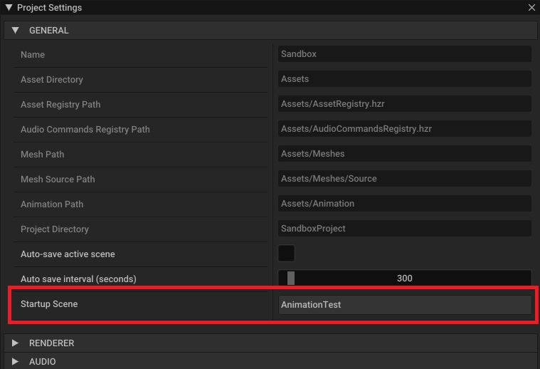
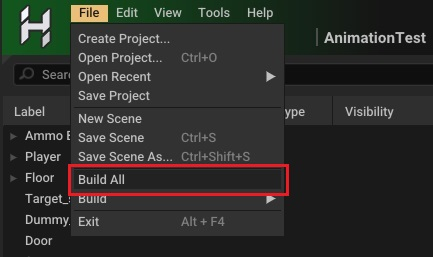
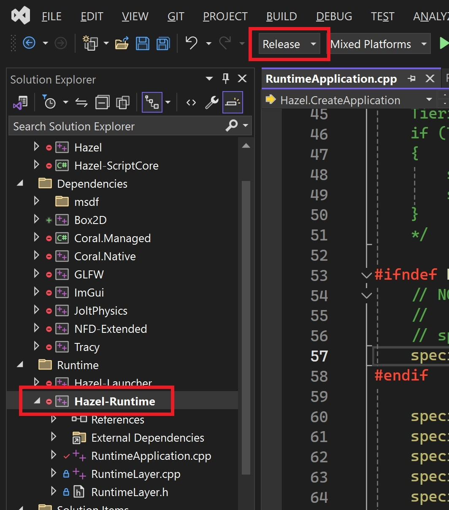
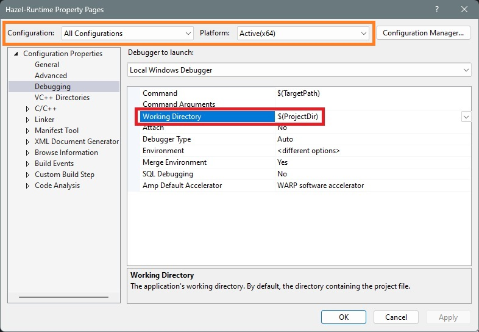
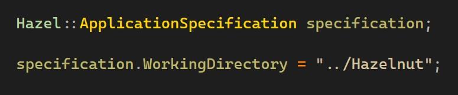
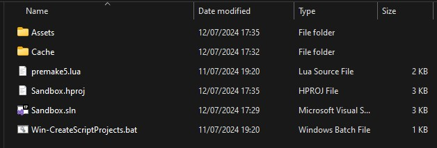
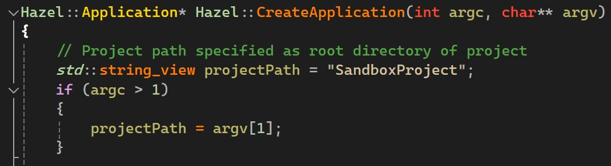
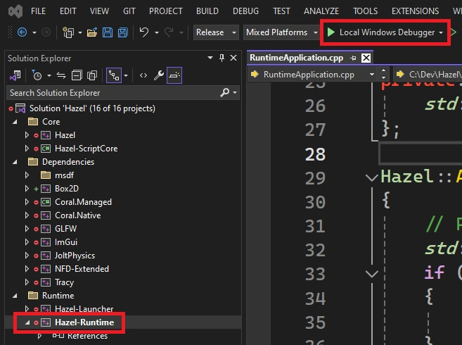

 
    
    <h1> The Runtime and Shipping Your Game 🚀</h1>

In order to distribute your game as a standalone executable rather than an editor project, Hazel (and every other game engine) has something called a _runtime_. There is a project called `Hazel-Runtime` in the root of the repository (accessible in, for example, the Visual Studio solution `Hazel.sln`) which builds into an executable that will run your project without the editor.

This Hazel Runtime project is what you distribute when you ship your game. As a standalone C++ executable, you have the freedom to customize specific details to suit your distribution needs, from configuring engine systems to adding build information and icons, to adding custom code and dependencies.

To run your project in the runtime, you first need to build it from Hazel's editor. We'll go over how to do this for the included Sandbox project, however this process is basically the same for any project - you just might have to tweak some variables.

## Step 1 - Build Your Project
The first step is to build your C# code and project data/assets. Make sure that `Coral.Managed`, `Hazel-ScriptCore`, and your C# project (`Sandbox` in this case) have built successfully. Make sure you can hit the Play button in the editor, and your game plays as expected (this will ensure scripts have been properly built).

Ensure your Startup Scene is set correctly in your Project Settings (Edit->Project Settings) as this will determine the first scene to load when you launch your game.

You can then select File->Build All to start a build of all required data and assets into Hazel's runtime formats.

Note that you can also build different types of runtime data separately via the File->Build-> menu, which is useful since building Asset Packs typically takes the longest and may not be required depending on what you've changed during the development.

## Step 2 - Configure and Run the Runtime
Once you've built all required data and assets, you can now run your project in the runtime! The following instructions will be for Windows, and will describe running your project through Visual Studio 2022, with a debugger attached in the Release build configuration.

Firstly, make sure your solution configuration is set to `Release` and the `Hazel-Runtime` project is set as your startup project (right-click -> Set as Startup Project).

The next step is very important - **you need to make sure your working directory is set correctly!** In order to run your project with the runtime successfully, Hazel needs to load the files that it needs. This includes the files you've just built, but also some core engine files.

There are two ways to set your working directory when running Hazel Runtime: externally through the application's working directory, or through C++ code in the `ApplicationSpecification` used to create the Hazel application. Note that the latter will be relative to the former. Below, both ways are described.

### Setting your working directory through Visual Studio
Open `Hazel-Runtime`'s property pages (right-click on `Hazel-Runtime` in the Solution Explorer and select `Properties`), and set the Working Directory under the Debugging page as shown below. Make sure that the Configuration and Platform are set to what you want, as shown in orange below.

### Setting Hazel Runtime's working directory through code

`RuntimeApplication.cpp` defines the runtime application's specification. The specification contains a setting for `WorkingDirectory`, which can be used to set a working directory for Hazel to use. Note that if a relative path is used, this will be relative to the application's original working directory, for example as set in Visual Studio above.

By default, Hazel 2024.1 ships with this `WorkingDirectory` setting set to `"../Hazelnut"`, as seen above. This is useful during development, because it will use all required core engine resources straight from the repository you are working in, since these resources reside within the `Hazelnut` directory.

You will almost certainly want to remove or change this setting when creating a build for use outside the Hazel solution in Visual Studio.

### Loading Your Project

Once your working directory has been correctly set, you need to actually load your project! To do this, you must specify the **root directory** of your project. This is the directory that contains your `Assets` directory, and (during development) your `.hproj` file.

Below is the root directory of the included Sandbox project, which is located in `Hazelnut/SandboxProject` relative to the root of the Hazel repository.

Setting the project to load can be done by setting the `projectPath` variable to a relative or absolute path, found in the first line of the `Hazel::CreateApplication` function in `RuntimeApplication.cpp`. You can also set this path via a command line argument. See below image.

Note that since the Sandbox project is relative to the `Hazelnut` directory, which has been specified as the working directory by default (as explained above), the project path can simply be set to `SandboxProject` if that project is to be loaded.

## Step 3 - Run the Runtime!
You are now ready to run the runtime! If `Hazel-Runtime` is set as the startup project, you can press the `Local Windows Debugger` "play" button (as shown below) or press F5 on your keyboard. You should now be running your project in the runtime!

`Release` is strongly recommended as it provides a balance of debugging and performance. `Debug` is often quite slow, but useful for more thorough debugging, and `Dist` contains no debug information and lots of useful features in Hazel written for debugging during development are stripped.

## Building a Distribution Build to Ship Your Project
Coming soon...